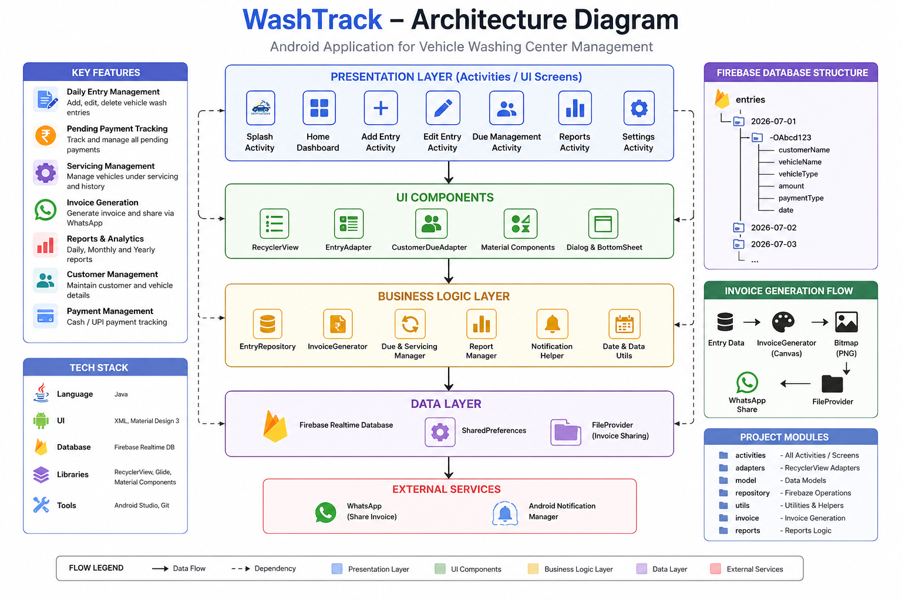

# WashTrack 🚗💧

> **Android Application for Vehicle Wash Center Management**
>
> A production Android application developed for real vehicle wash businesses to digitize daily operations, payment tracking, invoice generation, and business reporting.

<p align="center">


</p>

---

# 📌 About the Project

WashTrack is a production Android application built for small vehicle washing businesses that traditionally manage operations using paper registers and handwritten records.

The application digitizes the complete workflow—from recording vehicle wash entries to tracking pending payments, generating invoices, and viewing business reports.

Unlike a demo or tutorial project, WashTrack is actively deployed and used in real business operations.

---

# ⚠️ Repository Notice

This repository is intended **only as a project showcase**.

Since WashTrack is a **real production application developed for actual businesses**, the source code, Firebase configuration, business assets, and client-specific implementation have **not been made public** to protect client privacy and proprietary business logic.

This repository contains project documentation, architecture, screenshots, and implementation details only.

---

# 📱 Application Preview

<p align="center">


</p>

---

# 📖 Problem Statement

Many local vehicle wash centers still manage their daily operations manually.

Common problems include:

- Maintaining paper registers
- Tracking pending customer payments manually
- No business analytics
- Time-consuming report preparation
- Difficult invoice management

WashTrack replaces these manual processes with a simple Android application designed for non-technical users.

---

# ✨ Features

| Feature | Description |
|----------|-------------|
| 🏠 Dashboard | Quick overview of daily business activity |
| 📋 Daily Entry Management | Record vehicle wash entries |
| ✏️ Add / Edit Entry | Update customer and vehicle information |
| 💰 Due Management | Track pending payments customer-wise |
| 🚘 Servicing Management | Manage servicing customers separately |
| 🧾 Invoice Generation | Generate professional invoices using Android Canvas |
| 📤 WhatsApp Sharing | Share invoices directly with customers |
| 📊 Reports | Daily, Monthly and Yearly analytics |
| 🔍 Search | Quickly search customer records |
| 🔔 Notifications | Daily summary reminders |

---

# 🏗 Architecture

<p align="center">



</p>

### Architecture Overview

```
Presentation Layer
        │
        ▼
UI Components
        │
        ▼
Business Logic
        │
        ▼
Repository Layer
        │
        ▼
Firebase Realtime Database
        │
        ▼
External Services
```

---

# 📂 Project Modules

| Module | Purpose |
|---------|----------|
| Dashboard | Business overview |
| Daily Entries | Vehicle entry management |
| Due Management | Pending payment tracking |
| Reports | Revenue and business analytics |
| Invoice Generator | Canvas-based invoice generation |
| Notification Manager | Daily reminders |
| Repository | Firebase CRUD operations |

---

# 📸 Screenshots

## Dashboard


---

## Add Entry


---

## Due Management


---

## Reports


---

## Invoice


---

# 🔥 Firebase Database Structure

```text
entries
│
├── 2026-07-01
│     ├── pushId
│     │
│     ├── customerName
│     ├── vehicleName
│     ├── vehicleType
│     ├── amount
│     ├── paymentType
│     └── date
│
├── 2026-07-02
│
└── ...
```

---

# 🔄 Business Workflow

```text
Customer Arrives
        │
        ▼
Vehicle Entry Added
        │
        ▼
Payment Selected
        │
        ├────────► Cash
        │
        ├────────► UPI
        │
        ├────────► Pending
        │               │
        │               ▼
        │       Due Management
        │               │
        │               ▼
        │      Mark Paid Later
        │
        └────────► Servicing
                        │
                        ▼
               Invoice Generation
                        │
                        ▼
                 WhatsApp Sharing
```

---

# 🛠 Technology Stack

| Category | Technology |
|----------|------------|
| Language | Java |
| Platform | Android SDK |
| UI | XML + Material Design 3 |
| Database | Firebase Realtime Database |
| Architecture | Repository Pattern |
| Reports | Custom Analytics |
| Invoice | Android Canvas API |
| Sharing | FileProvider + WhatsApp Intent |

---

# 🚀 Production Deployment

- ✅ Developed for **2 local vehicle wash businesses**
- ✅ Actively used by **1 production client**
- ✅ Handles approximately **100–300 service entries per month**
- ✅ Supports multiple Firebase backends for client isolation
- ✅ Designed for non-technical business users

---

# 💡 Challenges Solved

### Responsive Invoice Generation

Initially, invoice layouts were designed using fixed pixel values. This caused alignment issues across devices with different screen densities.

**Solution**

- Responsive layout calculations
- Dynamic positioning
- Density-aware sizing
- Improved Canvas rendering for consistent output

---

### Customer Due Aggregation

Firebase stores every transaction separately.

To display customer-wise dues efficiently, entries were grouped using a `HashMap<CustomerName, CustomerDueSummary>`, allowing real-time calculation of pending totals and invoice generation.

---

# 📈 Future Improvements

- Multi-tenant SaaS version
- Admin Web Dashboard
- QR Payment Integration
- Customer SMS Notifications
- PDF Invoice Export
- Cloud Backup
- Role-based Authentication

---

# 📌 Project Status

🟢 Production Ready

🟢 Actively Maintained

🟢 Used in Daily Business Operations

---

# 👩‍💻 Author

**Sanika Lamkhade**

Android Developer | Java | Firebase

LinkedIn: *(Add your LinkedIn)*

Portfolio: *(Optional)*

---

<p align="center">

### ⭐ If you liked the project showcase, consider giving this repository a star.

</p>
